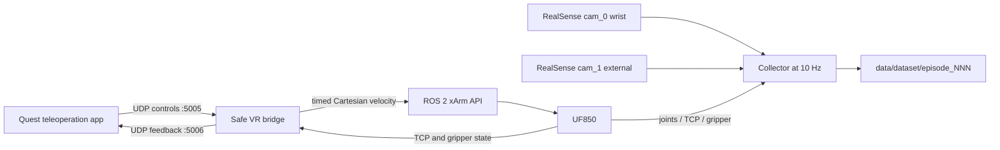

# UF850 VR Teleoperation and Data Collection

A safety-oriented, standalone data-collection stack for a UFactory UF850,
Meta Quest VR teleoperation, and two Intel RealSense cameras. It provides one
beginner-facing launcher (`easy_collect`), explicit lifecycle commands
(`vrctl`), atomic episode storage, validation, a guarded arm reset, and an
optional raw-to-RLDS converter for OpenVLA-OFT.

This repository contains code only. Raw episodes, RLDS files, logs, runtime
state, passwords, and machine-specific configuration are intentionally ignored
by Git.

## Safety warning

This software can command physical robot motion.

- Keep the hardware emergency stop within reach at all times.
- Clear people, cables, cameras, and objects from the complete robot path.
- Have a trained operator physically present for every hardware test.
- Start with `control.linear_speed_mm_s = 50.0`.
- Verify the workspace bounds and reset pose for the exact robot installation.
- Never assume that a pose copied from another UF850 is safe.
- Use the hardware emergency stop immediately if software does not stop motion.

The bridge includes timed commands, a Quest watchdog, input validation,
deadband, acceleration limits, a workspace guard, a collection lease, and
repeated zero-velocity shutdown. These controls reduce risk; they do not make
unattended operation safe.

The xArm controller firmware must be `1.8.0` or newer because this stack relies
on timed Cartesian velocity commands. The bridge refuses to arm on older
firmware.

## System overview



The bridge and collector are separate processes:

- the bridge owns VR motion and fails closed when Quest data or the collector
  lease becomes stale;
- the collector reads robot state and both cameras, then writes complete steps
  atomically;
- `easy_collect` prepares the network, starts or reuses the managed stack, and
  records exactly one episode;
- `reset_arm` is a separate guarded joint-space reset program.

## Tested reference setup

- Ubuntu Linux with Bash
- ROS 2 Jazzy
- UFactory `xarm_ros2` packages providing `xarm_api`, `xarm_description`, and
  `xarm_msgs`
- UF850/xArm controller firmware `>=1.8.0`
- Meta Quest teleoperation app sending supported UDP packets
- two RealSense color cameras, `1920×1080 YUYV @ 30 FPS`
- system Python `>=3.11` for `tomllib` and ROS `rclpy`
- a separate collector Python environment with OpenCV, NumPy, RealSense, and
  the xArm Python SDK

The bridge accepts the historical Quest packet sizes used by this project:
24, 28, 36, and 52 bytes.

## Repository layout

```text
VR_teleop_xarm/
  easy_collect                 beginner one-episode launcher
  vrctl                        lifecycle and validation CLI
  reset_arm                    guarded one-command reset
  convert_rlds                two-task no-op/RLDS helper
  config.example.toml         configuration template
  user_settings.env.example   local task/password template
  requirements-collector.txt collector dependencies
  requirements-rlds.txt       tested RLDS environment versions
  vrtool/                     implementation
  tests/                      unit and mock tests
```

Generated paths such as `data/`, `rlds_noop/`, `logs/`, `.runtime/`, and
`hf_publish/` are local-only and must not be committed.

## 1. Clone and create local configuration

```bash
git clone https://github.com/Kaixi66/VR_teleop_xarm.git
cd VR_teleop_xarm

cp config.example.toml config.toml
cp user_settings.env.example user_settings.env
chmod +x vrctl easy_collect reset_arm convert_rlds
```

Both copied files are ignored by Git:

- `config.toml` contains robot, camera, network, workspace, reset, and local
  Python/ROS paths;
- `user_settings.env` contains the current dataset name, task prompt, mode,
  hotspot choice, and optionally the hotspot password.

Never force-add either file to a public repository.

## 2. Install the required software

### System and ROS environment

The following commands are an example for Ubuntu; adapt them to the robot PC:

```bash
sudo apt update
sudo apt install python3 python3-venv network-manager iputils-ping iproute2 util-linux
```

Install ROS 2 Jazzy and UFactory's `xarm_ros2` workspace separately. Confirm
that both setup files referenced in `config.toml` exist:

```bash
source /opt/ros/jazzy/setup.bash
source ~/ros2_ws/install/setup.bash
ros2 pkg prefix xarm_api
ros2 pkg prefix xarm_description
ros2 pkg prefix xarm_msgs
```

The Python selected by `paths.system_python` must be able to import both
`rclpy` and `xarm.wrapper`:

```bash
/usr/bin/python3 -c 'import rclpy; from xarm.wrapper import XArmAPI; print("bridge dependencies OK")'
```

### Collector environment

Create the environment configured by `paths.collector_python`:

```bash
python3 -m venv --system-site-packages ~/robot_env
source ~/robot_env/bin/activate
python -m pip install --upgrade pip
python -m pip install -r requirements-collector.txt
```

`pyrealsense2` may require the platform's official Librealsense packages rather
than a PyPI wheel. Verify the final environment directly:

```bash
~/robot_env/bin/python -c 'import cv2, numpy, pyrealsense2; from xarm.wrapper import XArmAPI; print("collector dependencies OK")'
rs-enumerate-devices
```

## 3. Configure the exact hardware

Edit `config.toml` before any real-mode command.

### Robot

Set:

```toml
[robot]
ip = "YOUR_UF850_IP"
```

Confirm the controller is reachable:

```bash
ping -c 2 YOUR_UF850_IP
```

### Cameras

Find the two RealSense serial numbers:

```bash
rs-enumerate-devices | less
```

Then preserve this role order in `config.toml`:

```toml
[[cameras]]
name = "cam_0"
role = "wrist"
serial = "WRIST_CAMERA_SERIAL"

[[cameras]]
name = "cam_1"
role = "external"
serial = "EXTERNAL_CAMERA_SERIAL"
```

### Quest hotspot

Find the Wi-Fi interface:

```bash
nmcli device status
```

Set `hotspot.interface` and optionally change `hotspot.ssid` in
`config.toml`. Put the password only in the ignored `user_settings.env`:

```bash
USE_HOTSPOT="true"
HOTSPOT_PASSWORD="choose-a-new-password"
```

The password must contain at least eight characters. If it is left empty,
`vrctl` requests it with hidden terminal input when a hotspot must be created.
It is never written to Git-tracked files or the `vrctl` runtime state. If you
set it in `user_settings.env`, it remains in that ignored local file, so do not
force-add or share that file.

### Workspace and reset pose

Review all values under `[safety]` and `[reset]`.

The reset pose shipped in `config.example.toml` is a device-specific example,
not a universal UF850 home pose. Before using it:

1. compare all six joint angles with a known safe pose for the installation;
2. check the entire joint-space path, not only the endpoint;
3. verify that the gripper can safely open to the configured position;
4. run the dry-run command described in the reset section;
5. keep the emergency stop reachable during the first real reset.

## 4. Configure one collection task

Edit the ignored `user_settings.env`:

```bash
DATASET_NAME="place_object_in_bowl"
TASK_TEXT="Place the object in the orange bowl."
MODE="mock"
USE_HOTSPOT="true"
HOTSPOT_PASSWORD=""
```

`TASK_TEXT` is the single task/instruction/prompt string. It is stored as
`episode_meta.json.task` and becomes the per-step language instruction during
RLDS conversion.

`DATASET_NAME` may contain ASCII letters, numbers, dots, underscores, and
hyphens. Data is written below `data/<DATASET_NAME>/`.

## 5. Run a mock test first

Keep `MODE="mock"` and run:

```bash
./easy_collect
```

Let it record briefly, then press `Ctrl+C`. Validate the result:

```bash
./vrctl validate place_object_in_bowl --strict-v2
```

Mock mode does not access ROS, Wi-Fi, the robot, or RealSense cameras. Do not
continue to real mode until mock collection saves and validates successfully.

## 6. Record one real episode: exact beginner workflow

Set `MODE="real"`, keep the initial linear speed at `50 mm/s`, and follow this
order exactly.

### Before running the command

1. Power and enable the UF850 according to the manufacturer procedure.
2. Put the robot at the verified collection start pose.
3. Clear the workspace and hold the emergency stop.
4. Completely close the Quest teleoperation app.
5. It is fine if Quest is not connected to the robot hotspot yet.

### Start the launcher

```bash
./easy_collect
```

The launcher performs these stages:

1. prints the selected dataset, prompt, mode, output directory, speed, and
   hotspot choice;
2. runs the read-only `doctor` preflight;
3. creates or reuses the configured hotspot;
4. prints the computer's Quest UDP target, commonly `10.42.0.1:5005`;
5. waits without starting robot motion.

Connect Quest to the displayed hotspot. Quest may report **No Internet**; that
is expected for a robot-only local network. It must remain connected to the
Wi-Fi even though the network has no Internet access.

Keep the Quest app closed and type the uppercase confirmation:

```text
START
```

The launcher now starts the description, UF850 driver, and a paused bridge,
then connects the robot state reader and initializes both cameras.

### Open the Quest app at the correct moment

Wait for the terminal to print:

```text
COLLECTOR READY
```

This message means that the xArm SDK connection succeeded and both cameras
have delivered frames. The collector performs its first complete robot-state
sample after teleoperation arms; a later state-read failure still stops the
episode safely.

Only then open the Quest teleoperation app. Configure it to send UDP controls
to the IP printed by the launcher on port `5005`; feedback returns on port
`5006`. Hold both controllers still.

Do not move until the terminal prints:

```text
TELEOP ARMED
```

The bridge requires neutral Quest packets before arming. Once armed, perform
the task and keep the desired camera views unobstructed.

### Finish and save

Press `Ctrl+C` once when the episode is complete.

The collector will:

1. stop accepting new samples;
2. remove the motion lease so the bridge pauses and sends zero velocity;
3. finish the bounded write queue;
4. finalize `episode_meta.json`;
5. atomically rename the in-progress episode to `episode_NNN`.

Wait until the terminal confirms that the episode was saved. Do not power off
the PC while it is flushing data.

Normal finalization requires at least one complete observation/action step and
no hardware or storage failure. If you press `Ctrl+C` before `TELEOP ARMED`,
stop before a complete step exists, or encounter a device/write failure, the
collector reports an error and retains `.episode_NNN.inprogress` for diagnosis
instead of presenting it as a completed episode.

## 7. Record several episodes efficiently

After the first episode, the healthy ROS driver and bridge remain running but
motion is paused. The hotspot also remains active.

If you do **not** reset the arm, the fast path is:

1. leave Quest connected;
2. keep the Quest app open because the existing bridge is still healthy;
3. run `./easy_collect` again;
4. type `START`, keep the controllers neutral, wait for `TELEOP ARMED`, then
   record the next demonstration;
5. press `Ctrl+C` to save and wait for the saved confirmation.

If you **do** run `./reset_arm`, use the reset procedure in the next section.
Reset stops the managed bridge and ROS stack. After reset succeeds, treat the
next episode like a fresh start: close the Quest app, run `./easy_collect`, type
`START`, wait for `COLLECTOR READY`, then open the app and wait for
`TELEOP ARMED` before moving.

The collector automatically chooses the next free `episode_NNN` index. It
accounts for both finalized episodes and crash-residue directories, so it does
not overwrite earlier data.

When the whole session is finished, stop all managed robot/ROS processes:

```bash
./vrctl stop
./vrctl status
```

`vrctl stop` is session cleanup, not an episode-save command. Never use it to
end an active recording. First press `Ctrl+C` and wait for the terminal to say
that the episode was saved; stopping the control stack during collection makes
that episode incomplete.

`vrctl stop` does not disable the Wi-Fi hotspot; NetworkManager may keep it for
the next session.

## 8. Reset the arm between episodes

`reset_arm` is a dedicated hardware-motion program. It is not a cosmetic data
reset.

### What it does

With the reference configuration, it:

1. obtains the collector lifecycle lock and refuses to run while an episode is
   recording or still saving;
2. detects and safely stops a paused managed ROS/VR stack;
3. obtains the exclusive robot-control lock shared with the bridge and the
   startup lock shared with the stack manager;
4. checks for the known local controller processes supported by this project;
5. connects and checks that the controller is a healthy UF850, reads the
   current joints, and rejects a target outside the controller joint limits;
6. prints the current and target joints plus a warning if the gripper will open;
7. displays the configured countdown (`3` seconds in the reference template)
   before issuing any motion command;
8. enables motion, opens the gripper to the configured raw position, and moves
   all six joints to `reset.joint_angles_deg` at the configured speed and
   acceleration;
9. reads the final joints and verifies the configured tolerance;
10. enters STOP and disconnects, including on failures or `Ctrl+C`.

It never intentionally stops an unmanaged external robot controller. It fails
closed when the shared lock is owned or one of the project's known controller
processes is detected. It cannot prove that every possible third-party control
program is absent, so the operator must independently confirm that no other
program, pendant action, or remote client is controlling the arm.

### Dry-run first

```bash
./reset_arm --dry-run
```

Dry-run prints the selected robot IP, joint pose, movement timeout, joint speed
and acceleration, and the gripper target/speed without connecting to or moving
the arm. It does not currently print `reset.tolerance_deg` or
`reset.countdown_s`, so inspect those two values directly in `config.toml` as
well.

The shell wrapper still enforces reset exclusivity before dry-run. It refuses to
run while a collector is recording or saving and may stop a paused managed
ROS/bridge stack before printing the plan. Thus, dry-run causes no robot motion,
but it is not guaranteed to leave the managed software stack running.

### Perform the real reset

1. Confirm the collector has printed that the episode is saved.
2. Clear the complete arm path and hold the emergency stop.
3. Run:

   ```bash
   ./reset_arm
   ```

4. Watch the robot continuously through the countdown and motion.
5. If anything is unexpected, use the hardware emergency stop.
6. After reset succeeds, close the Quest app. The reset has stopped the managed
   bridge/ROS stack.
7. Start the next episode with `./easy_collect`; open the Quest app only after
   the terminal prints `COLLECTOR READY`.

If `reset_arm` reports that recording or saving is active, wait for collection
to finish. Do not kill the writer merely to make reset proceed.

## 9. Command reference

```text
./vrctl doctor
    Read-only checks for ROS, xArm reachability, cameras, ports, disk, Python,
    and hotspot state.

./vrctl prepare [--hotspot]
    Prepare Quest networking only. It does not start or move the robot.

./vrctl start [--hotspot] [--wait-quest]
    Start the ROS description, UF850 driver, and paused VR bridge.

./vrctl collect --dataset NAME [--task TEXT] [--mock]
    Record one episode. After at least one complete step, Ctrl+C finalizes a
    healthy episode; an early stop or failure retains an in-progress directory.

./vrctl run --dataset NAME [--task TEXT] [--hotspot] [--wait-quest]
    Doctor, start, collect one episode, then stop the stack.

./vrctl status
    Show managed process state, PIDs, and log files.

./vrctl stop
    Stop managed bridge/ROS processes, using the bridge's repeated-zero safe
    shutdown when it is alive. Use only after the episode has been saved.

./vrctl validate PATH_OR_NAME [--strict-v2] [--fast]
    Read-only validation of a dataset. Full JPEG decoding is the default;
    --fast performs a header-oriented scan.

./reset_arm [--dry-run]
    Guarded device-specific joint reset. The real command causes motion.
```

Use another configuration without replacing the default file:

```bash
./vrctl --config /path/to/config.toml doctor
```

## 10. Safety behavior

Default reference limits are defined in `config.example.toml`:

- bridge publish rate: `50 Hz`
- timed velocity duration: `0.15 s`
- stale Quest watchdog: `0.20 s`
- collector lease timeout: `0.50 s`
- input deadband: `0.05`
- angular speed limit: `0.3 rad/s`
- first-test linear speed: `50 mm/s`
- required neutral packets before arming: `3`
- workspace guard: configurable XYZ bounds

The bridge locks to the first valid Quest sender unless `network.quest_ip` is
configured. Packets from other hosts are ignored. Non-finite input, malformed
packets, stale Quest input, stale collection leases, and position-read failures
all fail closed.

Outside an active, ready collector, a persistent bridge keeps the UDP session
alive but publishes only zero velocity and suppresses gripper commands.

## 11. Raw data format

```text
data/<dataset>/
  episode_000/
    episode_meta.json
    step_00000/
      cam_0.jpg
      cam_1.jpg
      data.json
    step_00001/
      ...
```

- `cam_0.jpg`: wrist camera
- `cam_1.jpg`: external camera
- TCP XYZ: millimetres
- TCP rotation and six joint angles: degrees
- gripper: raw xArm position units
- action: `state[t + 1] - state[t]`, not divided by time
- nominal sample rate: `10 Hz`

Each `data.json` contains:

- `observations.ee_pos`
- `observations.joint_pos`
- `observations.gripper_pos`
- `action.delta_ee_pos`
- `action.delta_joint_pos`
- `action.delta_gripper`
- `meta` sampling, camera synchronization, frame, and timing information

The legacy direct Euler subtraction is preserved for compatibility. A wrapped
rotation delta is also stored in `meta.delta_ee_rotation_wrapped`.

`episode_meta.json` contains the single canonical task/instruction/prompt,
termination reason, camera identities, configuration snapshot, counts, timing,
and error statistics.

Steps are committed through temporary directories. An interrupted run may
leave `.episode_NNN.inprogress`; the validator reports it and never edits it.

## 12. Validate collected data

Validate one named dataset:

```bash
./vrctl validate place_object_in_bowl --strict-v2
```

The validator checks episode/step numbering, required files, JPEG dimensions
and decoding, finite JSON values, action alignment, timestamps, camera skew,
frame age, frame reuse, and episode metadata.

Use the faster mode only for a quick check:

```bash
./vrctl validate place_object_in_bowl --strict-v2 --fast
```

Full validation should pass before training or publishing data.

## 13. No-op filtering and RLDS conversion

The optional converter creates the local OpenVLA-OFT-compatible TFDS/RLDS
schema used by this project.

Create a separate Python 3.10 environment and install:

```bash
python -m pip install -r requirements-rlds.txt
export RLDS_PYTHON=/path/to/rlds-environment/bin/python
```

Edit the `USER SETTINGS` section of `convert_rlds`, then run:

```bash
RLDS_PYTHON=/path/to/rlds-environment/bin/python ./convert_rlds
```

The converter scans JSON and removes no-op steps before opening images. The
default no-op rule removes a step only when:

- translation norm is below `0.02 cm/step`;
- wrapped rotation norm is below `0.002 rad/step`;
- binary gripper state is unchanged from the preceding raw step.

Actions are not recomputed after filtering. The OFT transforms are:

- state: six joint angles, degrees to radians;
- action XYZ: TCP delta millimetres divided by 10 to centimetres;
- action rotation: wrapped Euler degrees to radians;
- action gripper: `+1=closed`, `-1=open`, default raw threshold `425`;
- external `cam_1`: crop `x=540:1620`, then LANCZOS to `224×224`;
- wrist `cam_0`: crop `x=760:1840`, then LANCZOS to `224×224`.

The compatibility key `observation.end_effector_pose` contains the six joint
angles in radians; it is not a Cartesian end-effector pose.

Outputs go below `rlds_noop/`, which is ignored by Git. Each conversion writes
a manifest and reopens every generated episode for validation.

Published example datasets:

- [Press Buttons raw](https://huggingface.co/datasets/AAyano/uf850-vr-teleop-press-buttons-raw)
- [Place Corn in Bowl raw](https://huggingface.co/datasets/AAyano/uf850-vr-teleop-place-corn-in-bowl-raw)
- [Press Buttons RLDS no-op filtered](https://huggingface.co/datasets/AAyano/uf850-vr-teleop-press-buttons-rlds-noop-filtered)
- [Place Corn in Bowl RLDS no-op filtered](https://huggingface.co/datasets/AAyano/uf850-vr-teleop-place-corn-in-bowl-rlds-noop-filtered)

The two RLDS releases use the same internal TFDS dataset name and version. Keep
them in separate parent directories so one cannot overwrite the other.

## 14. Troubleshooting

### Quest says "No Internet"

This is expected for a local robot hotspot. Keep Quest connected anyway. If it
disconnects automatically, forget the saved network, reconnect, and accept the
no-Internet connection.

### The hotspot was turned off between episodes

When a healthy bridge is being reused, `easy_collect` skips network preparation.
It therefore does not recreate a hotspot that was manually disabled while that
bridge remained running. First confirm that the previous episode was saved,
then recover with:

```bash
./vrctl stop
```

Close the Quest app and run `./easy_collect` again. This follows the fresh-start
path, recreates the configured hotspot, and tells you to reopen the app after
`COLLECTOR READY`.

### Quest is connected but the robot does not move

Check the order:

1. close the Quest app;
2. run `./easy_collect`;
3. connect Quest and type `START`;
4. wait for `COLLECTOR READY`;
5. open the app and hold controllers neutral;
6. wait for `TELEOP ARMED`.

Then inspect:

```bash
./vrctl status
ls -1dt logs/* | head
```

Open the newest `bridge.log`, `driver.log`, and `description.log`. Confirm the
Quest app uses the displayed computer IP and UDP port `5005`.

### `easy_collect` appears stuck

It may be waiting for one of four explicit events: hotspot preparation,
uppercase `START`, the xArm SDK connection plus frames from both cameras
(`COLLECTOR READY`), or neutral Quest packets (`TELEOP ARMED`). Read the last
terminal message before stopping it.

### Camera startup fails

Run:

```bash
rs-enumerate-devices
```

Confirm both serials, camera role order, USB bandwidth, and permissions. Close
other applications using the cameras.

### Reset refuses to run

This normally means the collector is still recording/saving, another process
owns the robot-control lock, a known local controller process is detected, or
the UF850 health/model check failed. Do not bypass the lock. Finish or safely
stop the owning process first.

### Stop everything safely

If an episode is recording, press `Ctrl+C` and wait for its saved confirmation
first. Running `vrctl stop` during collection intentionally removes motion
permission and stops the control stack, so the current episode is retained as
incomplete rather than saved as a successful demonstration.

```bash
./vrctl stop
```

If software does not stop physical motion immediately, use the hardware
emergency stop.

## 15. Tests

Run the collection/control tests in the collector environment:

```bash
~/robot_env/bin/python -m unittest discover -s tests -v
```

Run the RLDS converter tests in the RLDS environment:

```bash
RLDS_PYTHON=/path/to/rlds-environment/bin/python
"${RLDS_PYTHON}" -m unittest discover -s tests -p 'test_raw_to_rlds.py' -v
```

Check all shell entry points:

```bash
bash -n vrctl easy_collect reset_arm convert_rlds
```

The published reference was checked with 115 unit tests after adding the
public-settings regression test.

## 16. Security and privacy

- Never commit `config.toml`, `user_settings.env`, `.env`, raw episodes, RLDS
  shards, logs, or runtime files.
- Do not put a real hotspot password in `easy_collect`, README examples, shell
  history, issues, or screenshots.
- Raw episode metadata can contain local paths, robot IPs, camera serials, and
  task text; review it before publishing.
- RealSense images can contain people, screens, or laboratory information;
  inspect them before external release.
- Rotate a hotspot password immediately if it was ever committed or shared.

## License

No license has been selected yet. Public visibility alone does not grant
permission to copy, modify, or redistribute the code. The repository owner
should add an explicit license when the intended reuse policy is decided.
